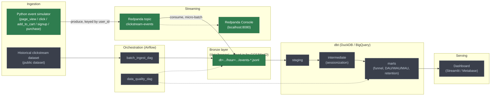

# Clickstream Pipeline

A simulated web/app clickstream analytics pipeline, built incrementally to demonstrate a modern data engineering stack end to end: event simulation → streaming ingestion → batch ingestion → orchestration → a layered dbt warehouse → a dashboard. Runs entirely on a laptop, no paid cloud resources required.

## Status

- **Phase 1 (done):** Python event simulator → Redpanda → bronze layer consumer
- **Phase 2 (in progress):** Airflow DAGs for batch ingestion of a historical clickstream dataset + data quality checks
- **Phase 3 (planned):** dbt project — staging → intermediate (sessionization) → marts (funnel analysis, DAU/WAU/MAU, retention), running on DuckDB locally with a BigQuery target available
- **Phase 4 (planned):** dashboard on top of the marts
- **Phase 5 (planned):** GitHub Actions CI running dbt tests + Python lint on every PR

## Architecture



Solid nodes are built (Phase 1); dashed nodes are planned for later phases.

## Phase 1: Event Simulator + Streaming Ingestion

### What's here

- `simulator/` — generates a realistic stream of clickstream events (concurrent simulated user sessions walking a `page_view → click → add_to_cart → purchase` funnel with drop-off at each step) and produces them to a Redpanda topic.
- `consumer/` — consumes the topic and writes newline-delimited JSON to a partitioned bronze layer at `data/bronze/events/dt=YYYY-MM-DD/hour=HH/`, the local stand-in for a GCS/MinIO raw landing bucket.
- `docker-compose.yml` — Redpanda (Kafka-API-compatible streaming broker) + Redpanda Console (web UI to browse topics/messages).

### Setup

```bash
cp .env.example .env

make up              # start Redpanda + Redpanda Console
make topic-create    # create the clickstream-events topic (3 partitions)

make venv-simulator   # create simulator/.venv and install its deps
make venv-consumer    # create consumer/.venv and install its deps
```

### Run

In one terminal:

```bash
make producer
```

In another terminal:

```bash
make consumer
```

- Watch messages live at the Redpanda Console: http://localhost:8080
- Or from the CLI: `docker compose exec redpanda rpk topic consume clickstream-events -n 5`
- Bronze files land under `data/bronze/events/dt=.../hour=.../events-*.jsonl` — inspect with `cat` / `jq`.

Stop either process with `Ctrl+C`; both flush/commit cleanly on shutdown. Stop the whole stack with `make down`.

### Tests

```bash
make test
```

Runs pytest sanity checks on the event generator: required fields present, timestamps non-decreasing within a session, funnel steps never go out of order, and purchase totals actually match what was added to the cart.

## What I'd explain in an interview

**Redpanda instead of Apache Kafka.** Same wire protocol (Kafka API), so every client library and the resume claim "built a Kafka-compatible streaming pipeline" both hold up — but Redpanda is a single binary with no Zookeeper/JVM, so it starts in seconds and uses a fraction of the RAM. A reasonable choice for a project meant to run on a laptop; a straightforward swap to real Kafka in a heavier environment.

**confluent-kafka over kafka-python.** It's the librdkafka-based client actually used in production systems, not just a pure-Python reimplementation of the protocol — a stronger "why did you choose this" answer than "it was easiest to pip install."

**Session/funnel modeling in the simulator.** Events aren't independent random draws — `ClickstreamSimulator` runs a pool of concurrent session state machines, each walking the funnel with a per-step drop-off probability. That's what makes a funnel-analysis mart meaningful later: there's an actual shrinking funnel in the data, not noise.

**Partitioned bronze layout.** `dt=YYYY-MM-DD/hour=HH/` mirrors how you'd lay out a real object-storage bucket for Hive-style partition discovery, so a downstream tool (Airflow, dbt external tables) can pick up new data incrementally instead of rescanning everything.

**Micro-batching + manual offset commits.** The consumer buffers messages and flushes every N messages or M seconds, whichever comes first — trading a little latency for far fewer, larger files (avoids the small-files problem that kills object-store query performance). Offsets commit only after a successful disk flush, giving at-least-once delivery: a crash between flush and commit means a few messages get reprocessed on restart, never silently lost. Getting to exactly-once would mean idempotent writes keyed by `event_id` — a natural follow-up design question.

**Keying by `user_id`.** Producing with `key=user_id` keeps all of a given user's events on the same partition, which preserves per-user ordering — something the downstream sessionization step in dbt will depend on.

**The confluent-kafka + SIGINT bug.** During Phase 1 verification, `Ctrl+C` silently didn't stop either the producer or the consumer — a plain `try/except KeyboardInterrupt` around the main loop never fired. Root cause: instantiating a `confluent_kafka.Producer`/`Consumer` interferes with Python's default SIGINT disposition (a known quirk of the underlying librdkafka C library), so the interpreter never raises `KeyboardInterrupt`. Confirmed it with a minimal repro outside the app code, then fixed it the documented way — registering explicit `signal.signal(SIGINT, handler)` / `SIGTERM` handlers that set a flag the main loop checks each iteration, instead of relying on the exception. A good example of not trusting "it should just work" for a library wrapping a C extension, and of isolating a bug with a minimal repro before patching the real code.

**Redpanda Console image migration.** The `docker-compose.yml` originally pointed at `docker.redpandadata.com/redpandadata/console`, which turned out to be a stale/unreachable registry path — both the Redpanda broker and Console images actually needed to come from Docker Hub (`redpandadata/redpanda`, `redpandadata/console`). Also hit a breaking config schema change between Console v2 and v3 (`kafka.schemaRegistry` became invalid, moved out of the `kafka` block), caught immediately by the container's own strict YAML validation. A small reminder that third-party Docker image references and config schemas drift between versions and are worth actually pulling and booting, not just copying from memory or an old example.
