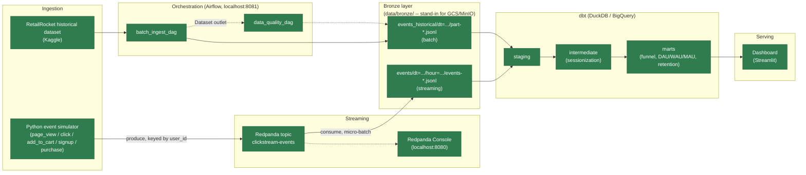

# Clickstream Pipeline

A simulated web/app clickstream analytics pipeline, built incrementally to demonstrate a modern data engineering stack end to end: event simulation → streaming ingestion → batch ingestion → orchestration → a layered dbt warehouse → a dashboard. Runs entirely on a laptop, no paid cloud resources required.

## Status

- **Phase 1 (done):** Python event simulator → Redpanda → bronze layer consumer
- **Phase 2 (done):** Airflow DAGs for batch ingestion of a historical clickstream dataset + data quality checks
- **Phase 3 (done):** dbt project — staging → intermediate (sessionization) → marts (funnel analysis, DAU/WAU/MAU, retention), running on DuckDB locally with a BigQuery target available
- **Phase 4 (done):** Streamlit dashboard on top of the marts
- **Phase 5 (planned):** GitHub Actions CI running dbt tests + Python lint on every PR

## Architecture



Solid nodes are built (Phases 1-4); dashed nodes are planned for later phases.

## Phase 1: Event Simulator + Streaming Ingestion

### What's here

- `simulator/` — generates a realistic stream of clickstream events (concurrent simulated user sessions walking a `page_view → click → add_to_cart → purchase` funnel with drop-off at each step) and produces them to a Redpanda topic.
- `consumer/` — consumes the topic and writes newline-delimited JSON to a partitioned bronze layer at `data/bronze/events/dt=YYYY-MM-DD/hour=HH/`, the local stand-in for a GCS/MinIO raw landing bucket.
- `docker-compose.yml` — Redpanda (Kafka-API-compatible streaming broker) + Redpanda Console (web UI to browse topics/messages).

### Setup

```bash
cp .env.example .env

make up              # start Redpanda + Redpanda Console
make topic-create    # create the clickstream-events topic (3 partitions)

make venv-simulator   # create simulator/.venv and install its deps
make venv-consumer    # create consumer/.venv and install its deps
```

### Run

In one terminal:

```bash
make producer
```

In another terminal:

```bash
make consumer
```

- Watch messages live at the Redpanda Console: http://localhost:8080
- Or from the CLI: `docker compose exec redpanda rpk topic consume clickstream-events -n 5`
- Bronze files land under `data/bronze/events/dt=.../hour=.../events-*.jsonl` — inspect with `cat` / `jq`.

Stop either process with `Ctrl+C`; both flush/commit cleanly on shutdown. Stop the whole stack with `make down`.

### Tests

```bash
make test
```

Runs pytest sanity checks on the event generator: required fields present, timestamps non-decreasing within a session, funnel steps never go out of order, and purchase totals actually match what was added to the cart.

## Phase 2: Airflow Batch DAGs + Historical Dataset Ingestion

### What's here

- `batch_source/` — `download_dataset.py` (idempotent Kaggle download of the [RetailRocket e-commerce dataset](https://www.kaggle.com/datasets/retailrocket/ecommerce-dataset)), `transform_to_bronze.py` (maps `view`/`addtocart`/`transaction` onto our `page_view`/`add_to_cart`/`purchase` event types and writes partitioned bronze JSONL), `quality_checks.py` (pure, unit-tested data quality checks), `config.py` (env-driven settings, same pattern as `simulator/config.py` and `consumer/config.py`).
- `airflow/` — a custom Airflow image (`Dockerfile` + `requirements.txt` adding `pandas`/`kaggle` to the base image) and two DAGs: `batch_ingest_dag` (download → transform) and `data_quality_dag` (runs the four checks against the freshly-written partition, auto-triggered via an Airflow Dataset dependency on the first DAG's output).
- `docker-compose.yml` gained a Postgres + Airflow (webserver/scheduler/triggerer) stack under a `profiles: ["airflow"]` tag, so it only starts with `make airflow-up`, independent of the always-on Redpanda stack from Phase 1.
- Historical events land in a **separate** bronze partition tree, `data/bronze/events_historical/dt=YYYY-MM-DD/part-*.jsonl` (partitioned by the event's own date), not mixed into the streaming path's `data/bronze/events/` tree — see "conformed schema" below.

### Setup

```bash
# One-time: create a free Kaggle account, then Account -> "Create New API Token"
# to download kaggle.json. Put its username/key into .env:
#   KAGGLE_USERNAME=...
#   KAGGLE_KEY=...

make venv-batch          # create batch_source/.venv and install its deps (for local/test runs)
docker compose --profile airflow build   # build the custom Airflow image (pandas + kaggle baked in)
make airflow-up          # start Postgres + Airflow webserver/scheduler/triggerer
```

On first start, macOS may prompt Docker Desktop for **Full Disk Access** (System Settings → Privacy & Security) the first time it bind-mounts a project under `~/Desktop`/`~/Documents`/`~/Downloads` — grant it and restart Docker Desktop if `airflow-init` fails with a `mkdir /host_mnt/... operation not permitted` error.

### Run

1. Open the Airflow UI at http://localhost:8081 (login: `.env`'s `AIRFLOW_ADMIN_USERNAME`/`AIRFLOW_ADMIN_PASSWORD`, default `admin`/`admin`).
2. Unpause `batch_ingest_dag` and `data_quality_dag` (both start paused).
3. Trigger `batch_ingest_dag` — either from the UI, or:
   ```bash
   docker compose exec airflow-scheduler airflow dags trigger batch_ingest_dag
   ```
4. `download_dataset` → `transform_to_bronze` run; once `transform_to_bronze` finishes, `data_quality_dag` fires automatically (no second trigger) via its Dataset dependency and runs the four checks sequentially (see "what I'd explain in an interview" — this was originally parallel, and got OOM-killed at real dataset scale).
5. Inspect the output: `data/bronze/events_historical/dt=.../part-*.jsonl`.

`make airflow-down` stops the Airflow/Postgres stack without touching the Redpanda stack.

### Tests

```bash
make test-batch
```

Unit tests for `batch_source/quality_checks.py` — both passing and deliberately-broken DataFrames (null required field, invalid `event_type`, duplicate `event_id`), proving the checks actually catch bad data rather than just passing on the happy path. `make test` runs this alongside the Phase 1 suite.

## Phase 3: dbt Warehouse

### What's here

- `warehouse/` — a dbt project (`dbt-duckdb` primary target, `dbt-bigquery` configured but not required to run) reading the two bronze JSONL trees directly, no loader step:
  - `models/staging/{stream,historical}/` — one staging model per source, typing raw fields and picking known keys out of `event_properties` (which vary by `event_type`).
  - `models/intermediate/` — `int_events_unioned` (conforms both sources into one event stream), `int_sessions` (real `session_id` for stream, a 30-minute-inactivity-gap heuristic for historical, which has none), `int_sessionized_events` (attaches a session to every event either way).
  - `models/marts/core/` — `dim_date` (per-source calendar spine), `fct_events`, `fct_sessions`.
  - `models/marts/product/` — `mart_funnel_analysis`, `mart_dau_wau_mau`, `mart_retention` (weekly cohorts). All three are computed **per source**, not combined — see "what I'd explain in an interview" below for why.

### Setup

```bash
make venv-dbt   # create warehouse/.venv and install dbt-core/dbt-duckdb/dbt-bigquery
make dbt-deps   # install the dbt_utils package
```

### Run

```bash
make dbt-run     # build all models against data/bronze/ (needs Phase 1 and/or Phase 2 bronze data on disk)
make dbt-build   # dbt-run + dbt-test in dependency order
make dbt-docs    # generate + serve the lineage/docs site
```

Output lands in a local DuckDB file (`warehouse/clickstream.duckdb` by default, `DBT_DUCKDB_PATH` in `.env`). The `bigquery` target (`--target bigquery`) reads `BIGQUERY_PROJECT`/`BIGQUERY_DATASET`/`BIGQUERY_KEYFILE` from `.env` — configured for the "how would this run in the cloud" conversation, not required for local dev.

### Tests

```bash
make dbt-test
```

Generic dbt tests (`unique`/`not_null` on primary keys, `accepted_values` on `event_type`/`source` against `simulator/schemas.py`'s contract, `relationships` from events to sessions) across every layer. Not folded into `make test` — these need real bronze data on disk, unlike the pure-unit Python suites.

## Phase 4: Streamlit Dashboard

### What's here

- `dashboard/` — a Streamlit app reading `warehouse/clickstream.duckdb` directly, read-only, no server/API layer in between:
  - `app.py` — thin entrypoint; defines the four pages via `st.navigation`/`st.Page` and calls `pg.run()`.
  - `views/` — one page per mart/mart-group: `overview.py` (KPIs + event-type mix), `funnel.py` (`mart_funnel_analysis`), `active_users.py` (`mart_dau_wau_mau`), `retention.py` (`mart_retention` as a cohort heatmap).
  - `db.py` — a cached, read-only DuckDB connection plus `st.cache_data`-wrapped query functions per mart.
  - `ui.py` — the shared sidebar source filter (`batch_historical` / `stream`) every page renders, so the choice persists across navigation.
  - `palette.py` — chart color roles (categorical/sequential/ordinal), values taken from the color-formula method in this repo's dataviz skill, validated for colorblind-safety and contrast rather than picked by eye.
  - Every mart is per-source (Phase 3's design), so the dashboard carries that forward rather than quietly re-combining stream and historical into one misleading view — see "what I'd explain" below.

### Setup

```bash
make venv-dashboard   # create dashboard/.venv and install streamlit/duckdb/pandas/plotly
```

### Run

```bash
make dashboard   # streamlit run dashboard/app.py -- needs warehouse/clickstream.duckdb to already exist (make dbt-build)
```

Opens at `http://localhost:8501`. The sidebar source filter applies to every page; switching it re-queries all four marts for that source.

## What I'd explain in an interview

**Redpanda instead of Apache Kafka.** Same wire protocol (Kafka API), so every client library and the resume claim "built a Kafka-compatible streaming pipeline" both hold up — but Redpanda is a single binary with no Zookeeper/JVM, so it starts in seconds and uses a fraction of the RAM. A reasonable choice for a project meant to run on a laptop; a straightforward swap to real Kafka in a heavier environment.

**confluent-kafka over kafka-python.** It's the librdkafka-based client actually used in production systems, not just a pure-Python reimplementation of the protocol — a stronger "why did you choose this" answer than "it was easiest to pip install."

**Session/funnel modeling in the simulator.** Events aren't independent random draws — `ClickstreamSimulator` runs a pool of concurrent session state machines, each walking the funnel with a per-step drop-off probability. That's what makes a funnel-analysis mart meaningful later: there's an actual shrinking funnel in the data, not noise.

**Partitioned bronze layout.** `dt=YYYY-MM-DD/hour=HH/` mirrors how you'd lay out a real object-storage bucket for Hive-style partition discovery, so a downstream tool (Airflow, dbt external tables) can pick up new data incrementally instead of rescanning everything.

**Micro-batching + manual offset commits.** The consumer buffers messages and flushes every N messages or M seconds, whichever comes first — trading a little latency for far fewer, larger files (avoids the small-files problem that kills object-store query performance). Offsets commit only after a successful disk flush, giving at-least-once delivery: a crash between flush and commit means a few messages get reprocessed on restart, never silently lost. Getting to exactly-once would mean idempotent writes keyed by `event_id` — a natural follow-up design question.

**Keying by `user_id`.** Producing with `key=user_id` keeps all of a given user's events on the same partition, which preserves per-user ordering — something the downstream sessionization step in dbt will depend on.

**The confluent-kafka + SIGINT bug.** During Phase 1 verification, `Ctrl+C` silently didn't stop either the producer or the consumer — a plain `try/except KeyboardInterrupt` around the main loop never fired. Root cause: instantiating a `confluent_kafka.Producer`/`Consumer` interferes with Python's default SIGINT disposition (a known quirk of the underlying librdkafka C library), so the interpreter never raises `KeyboardInterrupt`. Confirmed it with a minimal repro outside the app code, then fixed it the documented way — registering explicit `signal.signal(SIGINT, handler)` / `SIGTERM` handlers that set a flag the main loop checks each iteration, instead of relying on the exception. A good example of not trusting "it should just work" for a library wrapping a C extension, and of isolating a bug with a minimal repro before patching the real code.

**Redpanda Console image migration.** The `docker-compose.yml` originally pointed at `docker.redpandadata.com/redpandadata/console`, which turned out to be a stale/unreachable registry path — both the Redpanda broker and Console images actually needed to come from Docker Hub (`redpandadata/redpanda`, `redpandadata/console`). Also hit a breaking config schema change between Console v2 and v3 (`kafka.schemaRegistry` became invalid, moved out of the `kafka` block), caught immediately by the container's own strict YAML validation. A small reminder that third-party Docker image references and config schemas drift between versions and are worth actually pulling and booting, not just copying from memory or an old example.

**Choosing Airflow 2.x over 3.x.** Airflow's current major version (3.x) turned out to be a genuine architecture shift, not just new flags: a decoupled `apiserver` (replacing the webserver), a mandatory `dag-processor` service split out of the scheduler, JWT-based inter-component auth, a Fernet key requirement, and `Dataset` renamed to `Asset`. Verified this by pulling Airflow's own reference `docker-compose.yaml` for both the `stable` and `2.11.2` doc versions rather than trusting memory — the same "actually check, don't assume" lesson as the Redpanda Console registry. Deliberately targeted 2.x (webserver + scheduler + Postgres, `LocalExecutor`, dropping the Celery/Redis/worker/flower services the official reference defaults to): simpler locally, and still the version most existing tutorials, job descriptions, and production deployments use today, with concepts that transfer directly if a 3.x migration ever comes up.

**Two bronze partition trees, one conformed schema.** The historical dataset's events span months in the past, so mixing them into the streaming path's `dt=`-by-ingestion-date tree would be wrong — they land in a separate `events_historical/` tree partitioned by the event's *own* date instead. Both trees share the same JSON shape (`simulator/schemas.py`'s `ClickstreamEvent`, extended with one new defaulted `source` field: `"stream"` vs `"batch_historical"`), so a later dbt staging layer can `UNION ALL` them into one table. RetailRocket also has no session concept and no click/signup equivalent (only `view`/`addtocart`/`transaction`) — a realistic example of conforming heterogeneous sources to a common contract without pretending they're equally rich.

**Airflow Datasets for inter-DAG scheduling.** `data_quality_dag` doesn't run on a cron or need a second manual trigger — it's scheduled directly on the `Dataset` that `batch_ingest_dag`'s final task declares as an outlet, so Airflow's data-aware scheduling fires it automatically the moment the bronze partition is actually written. The Dataset URI is defined once in a shared `airflow/dags/_shared.py` (derived from the same `BatchConfig` the check tasks use to load data), rather than duplicated as a string literal in both DAG files — Dataset matching is exact-string-equality, so a copy-pasted typo between files is a real, silent way to break this wiring.

**Reused testing pattern from Phase 1.** `batch_source/quality_checks.py` is plain functions over a DataFrame — no Airflow or pandas-specific glue beyond the DataFrame argument itself — mirroring how `simulator/event_generator.py` keeps the funnel state machine as pure, testable logic separate from the Kafka-facing `producer.py`. Each DAG task is a thin wrapper that loads data and calls one check function. Same shape both times: business logic is unit-testable in isolation; the orchestration layer (Kafka client, Airflow operator) is a thin shell around it.

**Idempotent batch writes vs. append-only streaming writes.** `transform_to_bronze.py` deliberately overwrites deterministic output files (`event_id` is a `uuid5` hash of each row's natural key; filenames are `dt`/chunk-index based) so re-triggering the DAG produces byte-identical output, not accumulating duplicates. That's the opposite of the streaming consumer's `uuid4`-suffixed filenames (`consumer/kafka_to_bronze.py`) — correct there for an always-growing stream, wrong here for a static full-dataset transform. Verified by re-triggering the DAG and confirming the file count and `event_id` set didn't change.

**Compose profiles for independently-startable stacks.** Tagging every Airflow/Postgres service with `profiles: ["airflow"]` (via a single `x-airflow-common` YAML anchor) means `make up` still starts only Redpanda + Console, and `make airflow-up` (`docker compose --profile airflow up -d`) brings up the batch/orchestration leg separately — reflecting that the two ingestion paths are architecturally independent until they converge in dbt, without needing two separate compose files.

**The parallel-quality-checks OOM.** First real run against the actual ~2.75M-row RetailRocket dataset (not the tiny synthetic fixture used to verify DAG wiring) failed `data_quality_dag` with `return code -9` — SIGKILL, not an assertion error. Root cause: all four check tasks ran in parallel, each independently loading the full bronze partition into its own DataFrame (~1.5GB via `df.memory_usage(deep=True)`); four concurrent loads plus pandas' parsing overhead blew past the Docker VM's shared memory budget (7.65GB total, split across 6 containers). Fixed by chaining the checks sequentially (`>>`) instead of calling them independently — bounds peak memory to roughly one load at a time, trading wall-clock time for reliability. The synthetic 8-row fixture used for initial verification passed cleanly and couldn't have caught this; it only surfaced at real scale, which is exactly why a synthetic-data dry run isn't a substitute for at least one real end-to-end pass before calling a pipeline done.

**Real duplicate rows in the public dataset.** Once the OOM was fixed, `check_no_duplicate_event_ids` still failed — but this time as a genuine `AssertionError: Found 460 duplicate event_id values`, not a crash. Traced it to 918 rows in the raw CSV sharing an identical natural key (same visitor, same millisecond timestamp, same event, same item) — almost certainly double-fired analytics beacons, a real clickstream phenomenon, not a bug in our `uuid5`-based `event_id` generation (which was behaving exactly as designed: identical natural key → identical hash). Fixed with an explicit `drop_duplicates()` in `transform_to_bronze.py`, not by loosening the quality check — deciding what counts as a duplicate source event is a data-cleaning decision that belongs in the transform, while the check stays in place as a safety net for any *other* source of duplication. Added `tests/test_transform_to_bronze.py` as a regression test once this was understood.

**A pandas/NumPy binary incompatibility, caught writing that regression test.** Reproducing the dedup fix in a local pytest run segfaulted (`Segmentation fault: 11`) — not an assertion, a hard crash, and it reproduced on even a single-row `pd.to_datetime(..., unit="ms")` call in isolation. `pandas==2.2.2` predates NumPy 2.0's release, and neither `requirements.txt` pinned NumPy, so pip resolved whatever was latest — NumPy 2.5.1 on the host venv (Python 3.13), versus NumPy 1.26.4 inside the Airflow container (Python 3.11), where an already-installed compatible version happened to satisfy the constraint instead of upgrading. Same code, same pandas pin, opposite outcomes, purely from an unpinned transitive dependency resolving differently across environments. Fixed by pinning `numpy==1.26.4` explicitly in both `batch_source/requirements.txt` and `airflow/requirements.txt`, rather than relying on incidental resolution.

**Pinning `event_properties`' schema instead of trusting DuckDB's auto-detection.** `event_properties` has different keys per `event_type` (`element_id` for `click`; `url`/`referrer` for `page_view`; `item_id`/`transaction_id` for `add_to_cart`/`purchase`). `read_json`'s auto-detection infers one STRUCT shape per glob by sampling files, which is a real schema-drift risk when the keys genuinely vary file-to-file — a column can silently appear or vanish depending on which files got sampled. Fixed by passing an explicit `columns` schema in each source's `meta.external_location` (`warehouse/models/staging/*/​_*.yml`) and keeping `event_properties` as DuckDB's native `JSON` type instead of letting it flatten to a STRUCT, picking known keys apart in the staging model with `json_extract_string` instead.

**A two-layer templating collision, debugged by reading the compiled SQL.** That same `columns={...}` dict broke twice in two different ways before it worked. First, dbt-duckdb runs `external_location` through Python's `str.format_map()`, which reads any `{...}` as a format placeholder — `columns={'event_id': ...}` raised `KeyError: 'event_id'` because format_map tried to look up a field called `event_id` in its substitution dict. The obvious fix, doubling the braces (`{{ }}`) the way `str.format()` normally escapes literals, broke differently: dbt Jinja-renders the *same* string first, and by then `{{'event_id': ...}}` reads as a Jinja print-statement whose expression isn't valid syntax. The actual fix wraps just the doubled-brace dict in `...`, so dbt's Jinja pass leaves it untouched and the literal `{{ }}` only gets interpreted — correctly, this time — by `format_map()` afterward. Diagnosed by reading `duckdb_views().sql` (the actual compiled SQL DuckDB was executing) rather than guessing from the error message alone.

**A stale bronze file caught by a row-count spot-check, not a dbt test.** After the schema fix above, every dbt test still passed, but a manual sanity check (`stg_events_stream` count + `stg_events_historical` count should equal `fct_events` count) came up short by exactly the stream row count — stream events were silently disappearing between the union and the final fact table. Root cause: the `source` field ("stream" vs `"batch_historical"`) was added to the event contract (`simulator/schemas.py`) during the Phase 2 commit, but the Phase 1 bronze files already on disk (`data/bronze/events/dt=2026-07-23/...`) were never regenerated and don't have the key at all — so reading it from the JSON payload (as the explicit `columns` schema allowed) silently returned `NULL` for every stream row, which then failed the sessionization join's `e."source" = s."source"` condition. Fixed by not trusting the payload's `source` field at all: each staging model hardcodes the literal (`'stream'` / `'batch_historical'`) instead, since which bronze tree a file lives in already tells you the source — more robust than trusting a field that can silently drift out of sync with the schema that's supposed to produce it. A good example of why `unique`/`not_null` tests alone don't catch everything: they'd have passed even with the stream rows completely missing, since the remaining rows were still internally consistent. The row-count reconciliation is exactly the kind of check worth keeping even once the generic test suite is green.

**Flattening variable-shape JSON into a fixed, typed column set.** `event_properties` isn't one shape — it's genuinely different per `event_type` (`element_id` for `click`; `url`/`referrer` for `page_view`; `item_id`/`transaction_id` for RetailRocket's `add_to_cart`/`purchase`). The staging layer flattens the *union* of every key either source ever uses into one fixed set of typed columns (`json_extract_string(event_properties, '$.element_id')` etc.), NULL wherever a given event type doesn't carry that field — verified against real data: `click` rows have `element_id` populated and everything else NULL, `page_view` rows have `url`/`referrer` populated and everything else NULL, and so on, exactly matching each event type's actual shape, not a leftover guess from an earlier schema. This is the standard answer to "how do you handle variable-shape JSON in a warehouse": downstream marts never touch JSON or need to know which event types carry which properties, and a NULL in `item_id` on a `click` row is self-documenting (a property that event type never has), not a data quality problem to chase.

**A real asymmetry between the two sources' payload richness.** The stream simulator's `add_to_cart` and `purchase` events carry no `event_properties` at all — no `item_id`, no `transaction_id`, nothing (confirmed by querying `fct_events`: `count(item_id)` is 0 for every stream row, 100% populated for every historical row). So the two sources aren't just heterogeneous in which event types they have (stream has `click`/`signup`, historical doesn't) — they're heterogeneous in the *opposite* dimension too: stream is richer on session/funnel mechanics (real `session_id`, a `click` step) but thinner on transaction payload detail than historical (real `item_id`/`transaction_id`, no session concept at all). Worth naming explicitly rather than letting it pass as a quiet implementation detail — it's exactly the "heterogeneous sources conforming to one schema, each with real gaps" story that makes conforming them with `UNION ALL` a legitimate design problem rather than a formality. Practical consequence, checked directly rather than assumed: none of the three product marts currently aggregate on `item_id`/`transaction_id` (`mart_funnel_analysis` counts sessions by `event_type`; DAU/WAU/MAU and retention count distinct `user_id`), so this gap is dormant today — but a future "top purchased items" or "average cart value" mart would silently only reflect the historical source unless it explicitly filtered or labeled by `source` first.

**Per-source funnel, DAU/WAU/MAU, and retention marts, not one combined view.** The two sources don't share a timeline: historical spans 2015-05-03 to 2015-09-18 (139 days), stream is a single dev smoke-test day in 2026. A combined `dim_date` spine would run ~4,100 days with an 11-year gap of all zeros in the middle, and historical has no `click`/`signup` events at all so a combined funnel would mean either dropping a real step or fabricating one historical can't have. `dim_date` instead generates one spine per source (each scoped to its own min/max `event_date`), and `mart_funnel_analysis`/`mart_dau_wau_mau`/`mart_retention` all carry a `source` column and are computed independently per source — an explicit design tradeoff surfaced by actually looking at the data's shape rather than assuming a combined view would be meaningful.

**Ingestion-time partition columns kept out of business logic.** `hive_partitioning=true` on the stream source surfaces `dt`/`hour` as columns, but those reflect *consumer flush time* (`consumer/kafka_to_bronze.py`'s `_flush` uses `datetime.now(utc)`, buffered up to `CONSUMER_FLUSH_INTERVAL_SECONDS`), not event time — a event generated near a flush boundary could land in a different hour partition than its own timestamp implies. Staging models parse the canonical `event_date`/`event_timestamp` from the `event_timestamp` payload field itself and keep the hive-derived columns only as `_ingested_dt`/`_ingested_hour` — present for lineage/debugging, never joined or filtered on in any downstream model.

**No server layer between the dashboard and the warehouse.** `dashboard/db.py` opens `duckdb.connect(..., read_only=True)` straight at `warehouse/clickstream.duckdb` — DuckDB is an embedded single-file database, so there's no API, no ORM, and no second copy of the marts to keep in sync. Read-only isn't just a safety default: the dashboard never writes, and it means it can't hold a lock that would block a `dbt run` writing the same file.

**A widget-state bug traced past its first, wrong hypothesis.** The sidebar source filter (`dashboard/ui.py`) reset to `batch_historical` every time a user switched pages, even though every page rendered `st.selectbox(..., key="source")` — the textbook pattern for state that should persist. First hypothesis: Streamlit's classic auto-discovered `pages/` directory is documented to reset widget state on page navigation, so the fix should be migrating to the modern `st.navigation`/`st.Page` API (`dashboard/app.py`), which exists specifically to fix that. Migrated — bug persisted, unchanged. That disproved the first hypothesis and pointed at the actual cause: `render_source_selector()` computed `index=sources.index("batch_historical")` — a *hardcoded* default — on every call, never reading the user's previous choice. On reruns of the *same* page this was masked (Streamlit keeps a widget's live value across reruns of one script regardless of `index`), which is exactly why it looked correct until a page switch mounted a genuinely fresh widget instance and the hardcoded default won. Fixed with the standard decoupled pattern: the actual selection lives in a plain `st.session_state["source_value"]` key (not the widget's own key), seeded into `index` on every render and synced via `on_change` — the widget's key and the persisted value are no longer the same variable. A reminder that a plausible, documented cause (and a real fix for a related class of bug) isn't the same as *the* cause — the st.navigation migration was worth keeping regardless, but it didn't fix this bug, and re-testing after the "fix" is what caught that.

**A Plotly axis-inference bug, only visible by actually toggling to the sparse dataset.** `mart_retention`'s heatmap and `mart_dau_wau_mau`'s line chart both looked correct against `batch_historical` (139 days) — clean date-formatted axes, no complaints. Switching the source filter to `stream` (a single day) turned both into a nonsensical axis: tick labels like `23:59:59.9996` and `00:00:00.0002` spanning a fake microsecond-wide range around one real data point. Cause: Plotly infers an axis type from the data, and a single formatted date string still gets read as a continuous date axis rather than a discrete category — with only one point, its autorange degenerates instead of just placing one tick. Fixed by forcing `type="category"` explicitly: unconditionally in the retention heatmap (cohort weeks are inherently discrete buckets regardless of row count), conditionally in the active-users line chart (only when there's a single row — a real date axis's month-level tick formatting is worth keeping for the multi-week case). Neither `batch_historical` view would ever have surfaced this; it's a direct argument for the "run and drive it in a browser, toggle every meaningful state" step over trusting one screenshot of the happy path.
